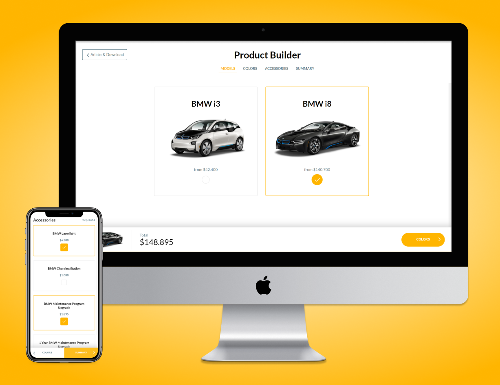

# HouseVo 🏠

<p>
  
  
  
  
  <a href="https://flighttypro.netlify.app/">
    
  </a>
</p>

**Single Page Application** that allows you to customize your car before purchasing it.

On a spending spree? [Explore now!](https://housevo.vercel.app/) 👈

<a href="https://housevo.vercel.app/" title="Explore now!">
  
</a>

> 🌐 [Website](https://flighttypro.netlify.app/)

Based on [this project](https://codyhouse.co/demo/product-builder/index.html), it's an exercise done during the selection process for [Casavo](https://casavo.com/).

## Features 💡

Works both on **mobile** and **desktop**:

- iPhoneX (375 x 812)
- fullHD (1920 x 1080)

Has small **animations** and page **transitions**.

Tested with [Cypress](https://www.cypress.io/).

## Contributing 🤝

**Getting started** is very easy:

```bash
$ git clone https://github.com/vikvikvr/housevo.git
$ cd housevo
$ npm install
$ npm run dev
```

To **test** the app with Cypress

```bash
$ npm run test
```

Happy hacking and remember: **PRs are welcome**! 😄
